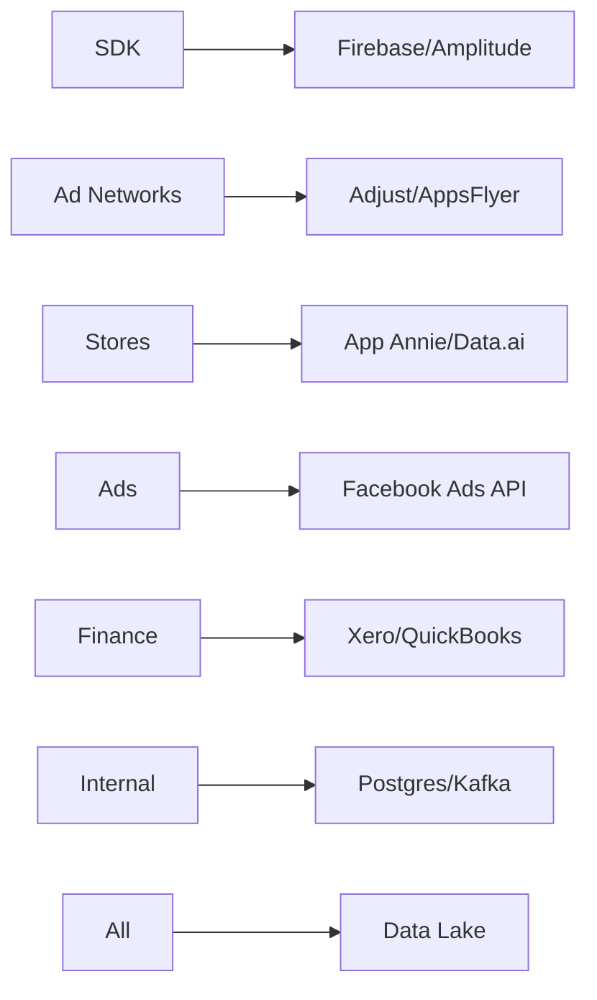

## Tổng Hệ Thống BI Cho Công Ty Game & App Mobile: Chiến Lược Triển Khai Toàn Diện

### 1. Danh Sách Chức Năng Theo Nhóm Người Dùng
**Ban lãnh đạo/CEO:**
- Dashboard tổng quan đa chiều: Doanh thu toàn cầu, LTV, Burn Rate, Market Share
- Cảnh báo biến động KPI chiến lược (Slack/Email alerts)
- Phân tích cohort đa chiều (theo game, khu vực, nền tảng)
- Scenario Modeling: Dự báo tài chính dựa trên UA spend

**Product Owner/Game Designer:**
- Funnel Analysis: Từ onboarding đến purchase
- A/B Testing Dashboard: Kết quả thử nghiệm cơ chế game
- Player Behavior Heatmaps: Phân tích hành vi trong game
- Virtual Economy Monitoring: Cân bằng vật phẩm/tiền tệ game

**UA & Monetization Team:**
- Omni-Channel Attribution: So sánh hiệu quả kênh (Facebook, TikTok, Google)
- ROAS Forecasting: Dự báo hiệu quả chiến dịch
- Ad Creative Performance: Tỷ lệ CTR/CPI theo creative
- LTV Optimization: Đề xuất điều chỉnh ngân sách UA

**QA/Dev Team:**
- Crash Analytics Real-time: Phân loại crash theo thiết bị/OS
- Performance Monitoring: FPS, memory usage, loading time
- Bug Tracking Integration: Jira/Sentry kết nối dữ liệu

**Finance Team:**
- P&L Tự Động: Phân bổ doanh thu theo game/app
- CAC/CLTV Reconciliation: Đối chiếu chi phí acquisition
- Cash Flow Projection: Dự báo dòng tiền theo quý

**HR Team:**
- Productivity Analytics: Kết nối Jira/HRIS
- Burnout Risk Alerts: Phân tích OT/velocity

### 2. Chỉ Số Đo Lường Chiến Lược
| **Mảng**               | **KPI Chính**                                                                 |
|-------------------------|-------------------------------------------------------------------------------|
| **User Acquisition**    | CPI, ROAS (1/7/30d), Retention D1/D7/D30, Installs by Source, Tap-to-Install Rate |
| **Product Metrics**     | DAU/WAU/MAU, Session Length, ARPDAU, ARPPU, Churn Rate, Level Completion Rate |
| **Monetization**        | Ad Revenue: eCPM, Fill Rate, IAP Revenue: Conversion Rate, Average Purchase Value |
| **Technical Health**    | Crash Rate, ANR Rate, Load Time 95th Percentile, API Error Rate               |
| **Tài Chính**           | Gross Profit Margin, CAC, CLTV:CAC Ratio, Burn Rate, ROI per Title            |

### 3. Yêu Cầu Kỹ Thuật Chi Tiết
**Kiến Trúc Đề Xuất:**
```
[Data Sources] → [Stream Ingestion] → [Data Lake] → [ETL] → [Data Warehouse] → [Semantic Layer] → [BI Tools]
```
- **Data Lake:** AWS S3 / Google Cloud Storage (raw data dạng Parquet)
- **Data Warehouse:** Snowflake/BigQuery (xử lý petabyte-scale)
- **Stream Processing:** Kafka + Flink (cho real-time event)
- **ETL/ELT:** Airflow + dbt (quản lý data transformation)

**Kết Nối Data Sources:**


**Công Cụ BI:**
- Looker Studio + BigQuery (cost-effective)
- Power BI + Azure (doanh nghiệp Microsoft)
- Mixpanel (cho product analytics)
- Redash cho dev team query

### 4. Tổ Chức Dữ Liệu & Pipeline
**Schema Thiết Kế:**
- Kimball Methodology: Fact Tables (user_sessions, purchases, ad_impressions) + Dimension Tables (users, games, campaigns)
- Event Schema: Standard hóa với JSON Schema (user_id, event_name, timestamp, properties)

**Data Pipeline:**
- Realtime: Game events → Kafka → Flink → Druid (cho dashboard realtime)
- Batch Daily: Airflow DAGs xử lý ETL lúc 2AM GMT
- Data Quality: Great Expectations checks tại mỗi pipeline stage

**Phân Quyền:**
- Role-Based Access Control (RBAC):
  - CEO: Full access + financial projections
  - Product Team: Chỉ dữ liệu game cụ thể
  - Finance: Không xem dữ liệu raw PII

### 5. Thiết Kế Dashboard & Visualization
**Biểu Đồ Ưu Tiên:**
- UA Team: Cohort Line Charts (retention), Sankey (attribution)
- Product: Funnel Bars, Heatmaps (level difficulty)
- Finance: Waterfall Charts (revenue breakdown)

**Dashboard Mẫu:**
```plaintext
[Game Performance Executive Dashboard]
- Top Header: KPI Cards (MAU, Revenue, LTV)
- Left: Geo Map (revenue by country)
- Center: Time Series (DAU vs Revenue 7d)
- Right: Leaderboard (Top 5 games by ROI)
```

**So Sánh Dữ Liệu:**
- Cohort Analysis: Sliding date selector + dimension breakdown
- Game Comparison: Normalized metrics (per DAU)
- Trend Analysis: YoY/WoW growth rate overlays

### 6. Nhân Sự Vận Hành BI
**Vai Trò Cốt Lõi:**
- Data Engineer (2): Xây pipeline, optimize warehouse
- BI Analyst (3): Xây dashboard, training user
- Data Scientist (1): LTV modeling, predictive analytics

**Năng Lực Yêu Cầu:**
- SQL nâng cao + Python
- Hiểu UA metrics (SKAN, MMPs)
- Kinh nghiệm game economy

**Mô Hình Triển Khai:**
- Phase 1: Outsource setup infrastructure
- Phase 2: In-house team vận hành + phát triển
- Tối ưu: Hybrid - duy trì core team, outsource data engineering

### 7. Best Practices & Case Studies
**Thành Công Đáng Chú ý:**
- **Supercell:**
  - Custom event pipeline xử lý 10B+ events/ngày
  - Real-time A/B testing dashboard cho game balancing
- **Playrix:**
  - Centralized DWH trên Snowflake + Tableau
  - Tự động hóa 95% marketing reports

**Xu Hướng Toàn Cầu:**
- Embedded Analytics: Tích hợp BI trực tiếp vào internal tools
- Predictive BI: Dùng ML dự báo churn/LTV
- Data Mesh: Phân quyền data ownership theo team

### 8. Sai Lầm Thường Gặp & Giải Pháp
| **Sai Lầm**                     | **Cách Phòng Tránh**                                  |
|----------------------------------|-------------------------------------------------------|
| Data Silos (mỗi team dùng tool riêng)  | Chuẩn hóa data stack ngay từ đầu                      |
| Metric Inconsistency (định nghĩa KPI khác nhau) | Xây dựng data dictionary tập trung + semantic layer   |
| Over-Engineering (đầu tư real-time không cần thiết) | Bắt đầu với batch processing, scale dần               |
| Poor Data Quality (dữ liệu không đáng tin) | Implement data quality framework ngay phase 1         |
| Dashboard Sprawl (tạo quá nhiều dashboard vô dụng) | Governance: Review dashboard hàng quý + usage tracking|

### Lộ Trình Triển Khai Khuyến Nghị
1. **Tháng 1-2:**
   - Setup data lake trên GCP/AWS
   - Kết nối 3 data source chính (Firebase, AppsFlyer, Store Connect)
   - Xây executive dashboard cốt lõi

2. **Tháng 3-4:**
   - Triển khai full ETL pipeline
   - Xây product & UA dashboard
   - Training user cơ bản

3. **Tháng 5-6:**
   - Tích hợp predictive analytics
   - Thiết lập data governance policy
   - Tối ưu hóa query performance

**Chi Phí Ước Tính:**
- Cloud Infrastructure: $15k-$30k/tháng (cho 10M+ DAU)
- BI Tools License: $10k-$50k/năm
- Team: $250k-$500k/năm (tùy quy mô)

> **Lời Khuyên Then Chốt:** Bắt đầu với "Single Source of Truth" - Tập trung xây dựng data warehouse chuẩn hóa trước khi phát triển dashboard. Sử dụng framework như dbt để đảm bảo tính nhất quán metric. Đo lường ROI của hệ thống BI qua chỉ số "Time to Insight" - giảm từ tuần → phút cho quyết định chiến lược.